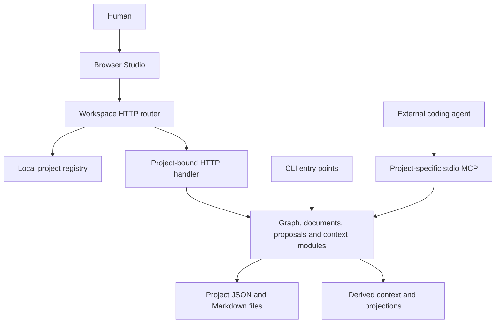
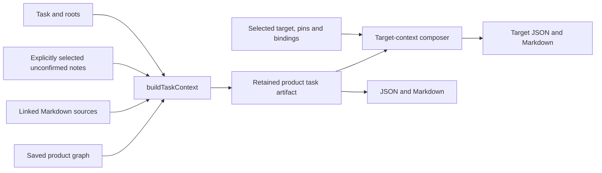

# Architecture: current system and intended extension points

Status: as-built description at the [documentation baseline](README.md#baseline-and-status). Future sections are explicitly marked. Source links describe actual modules, not proposed services.

## 1. System boundary

Product Graph is a **local, file-backed application with a browser UI and a modular Node.js backend**. It is not a native desktop binary, microservice system, graph database or hosted multi-tenant service. TypeScript runs using Node's type-stripping option; UI code is HTML/CSS and browser ES modules with direct DOM/SVG rendering. The stack and entry points are declared in [package.json](../package.json).

There are two different things called a project: this software repository, and each product folder a user opens in Studio. The catalog points to those folders; it does not merge their semantic graphs.

CLI/MCP use shared modules and files; they do not require a call through the HTTP router. The HTTP server binds to loopback. Sources: [workspace-server.ts](../src/workspace-server.ts), [server.ts](../src/server.ts), [cli.ts](../src/cli.ts), [mcp.ts](../src/mcp.ts).

## 2. Responsibilities

| Boundary | Code | Responsibility |
| --- | --- | --- |
| Project workspace | [project-registry.ts](../src/project-registry.ts), [workspace-server.ts](../src/workspace-server.ts) | Register/create folders, resolve each request's catalog ID, serve Studio. |
| UI coordination | [app.js](../ui/app.js), [studio-pages.js](../ui/studio-pages.js) | Working graph, inspector drafts, page/focus navigation and review integration. |
| Canvas | [studio-state.js](../ui/studio-state.js), [canvas-layout.js](../ui/canvas-layout.js) | Bounded visibility, layout, pins and connector geometry. |
| Graph core | [types.ts](../src/types.ts), [commands.ts](../src/commands.ts), [validate.ts](../src/validate.ts) | Models, graph changes and implemented diagnostics. |
| Sources and persistence | [io.ts](../src/io.ts), [documents.ts](../src/documents.ts), [local-files.ts](../src/local-files.ts) | JSON/Markdown reads, file plans, bounded readers and local-path checks. |
| Sketch and review | [visual-authoring.ts](../src/visual-authoring.ts), [proposals.ts](../src/proposals.ts) | Separate sketch source, explicit definition compilation and pending proposals. |
| Context | [context.ts](../src/context.ts), [task-context.ts](../src/task-context.ts), [implementation-context.ts](../src/implementation-context.ts) | Legacy graph summary; task/source build; target-aware composition. |
| Targets | [implementation-targets.ts](../src/implementation-targets.ts), [implementation-api.ts](../src/implementation-api.ts) | Deployment configuration, template pins, findings and endpoint adapter. |
| Future generation contract | [compiler.ts](../src/compiler.ts) | ProductIR and generic target-template interface only; no registered generator. |

These are responsibility groups, not enforced Clean Architecture layers. Some modules combine filesystem access and application logic. UI mutations are not all routed through the backend command layer. A future cleanup should reduce drift without inventing a second graph engine.

## 3. Session and project isolation

Each Studio page is bound to `/project/:catalogId/`. The [project client](../ui/project-client.js) rewrites `/api/...` to `/api/projects/:catalogId/...`; the server resolves that ID for every request. It does not keep a mutable global active project. Switching prompts for unsaved work and reloads the JavaScript session via [project-session.js](../ui/project-session.js).

Working graph/layout, inspector draft, navigation history and camera are different states. Back/Forward change scope/lens/selection/search. Graph Undo/Redo restores local graph/layout snapshots, not sketch or target configuration. Save submits the full working graph even when a lens hides most objects. Async UI requests must not apply stale results to a newer selection.

This prevents accidental project/session mixing through normal routes; it is not user-account authorization, process isolation or protection against a client with independent filesystem access.

## 4. Sources and writes

Each information kind has one owner: graph JSON for product structure; Markdown for source text; sketch JSON for exploratory cards; target JSON for deployment choices; layout for presentation. See the [data model](data-model.md).

| Write operation | Current behavior |
| --- | --- |
| Graph/layout Save | Check observed workspace revision in workspace mode, validate/preflight graph and layout, replace records and remove stale graph JSON. Single-project legacy mode permits omission of that header. |
| Sketch Save | Separate board revision and cooperating-writer lock; replace `sketches/board.json`. Does not save the graph. |
| Target Save | Separate revision including config/model/template inventory/location; cooperating-writer lock; replace `implementation/targets.json`. |
| Proposal Apply | Check current graph; sketch-origin proposals additionally check source board and reviewed proposal content; save graph, then proposal status. |

Atomic replacement is **per file**, not a multi-file transaction. Proposal status and graph are separate writes. Some older helpers such as `saveProposal()` use ordinary file writes. Locks protect cooperating writers only; revision checks do not eliminate races with arbitrary external editors. There is no crash-recovery journal or background synchronization service. Source: [io.ts](../src/io.ts), [server.ts](../src/server.ts), [visual-authoring.ts](../src/visual-authoring.ts), [implementation-targets.ts](../src/implementation-targets.ts).

## 5. Context and target flow

Target composition calls the product task builder once. It adds only selected-target bindings in the task model and reports omissions/drift. The three context contracts are deliberately different; the old graph summary is not silently upgraded. None calls a model or grants execution rights. [Agent workflow](agent-workflow.md) describes these interfaces.

Template slots and `mapped-declaration` are metadata compatibility, not runtime capabilities. ProductIR preserves objects/relations/document records without making a product graph executable. Adding a target does not register a generator.

## 6. Security, performance and operational limits

[Local HTTP guards](../src/local-http.ts) and [local-file helpers](../src/local-files.ts) check request/path boundaries for their call sites. Do not describe all filesystem consumers or legacy MCP commands as equally hardened. There is no cloud login/ACL layer, untrusted-code sandbox or exported-secret redaction engine. Do not expose the local server as a hosted service without a separate security design.

The implementation reads many files synchronously and constructs graph/document indexes in memory on demand. There is no persistent graph/search database, incremental watcher, distributed queue or real-time collaboration protocol. Current count/size limits bound some operations; they are not a measured performance guarantee.

## 7. Planned extensions, not current components

A supported generator should consume product semantics plus explicit target contracts, preview changes and preserve generated/custom ownership. A workflow runner needs typed data/control edges, bounded execution and distinct permissions. Neither should reinterpret every semantic edge as execution order.

Prioritize shared mutation/validation semantics, consistent revisions, integration tests and source-document editing before new infrastructure. Preserve the modular local architecture until measured constraints justify a change. See [roadmap](roadmap.md) and [decision register](architecture-decisions.md).
